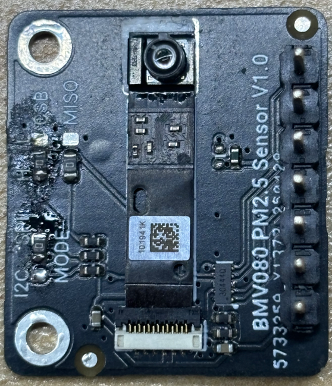

# DFRobot_BMV080

- [中文版](./README_CN.md)

This BMV080 PM2.5 sensor module is designed to be compact, highly accurate, and has a wide measurement range. Its core is based on the latest BMV080 sensor element developed by Bosch - the world's smallest PM air quality sensor. Its size is over 450 times smaller than similar products on the market. Although the size has been revolutionarily reduced, its performance remains undiminished. It can not only accurately measure the mass concentration of PM2.5 particles in the air, but also support the detection of PM1 and PM10.<br>
Traditional PM2.5 sensors usually rely on fans or ducts to introduce freely floating particles into the detection area, thus being larger in size and accompanied by the noise from the fans and dust accumulation problems, which increase maintenance costs and the risk of failure. However, this sensor adopts a measurement principle similar to a camera, using laser optical technology, to calculate the mass concentration based on the counting and relative speed of particles in the free space. It ingeniously uses the natural airflow around to drive the particles into the detection area for direct measurement, without the need for fans or forced air flow systems, thus eliminating maintenance troubles and avoiding dust accumulation caused by fans, significantly improving the reliability of the equipment. <br>

 
## Product Link（[https://www.dfrobot.com.cn](https://www.dfrobot.com.cn)）
    SKU:SEN0663

## Table of Contents

  * [Summary](#summary)
  * [Installation](#installation)
  * [Methods](#methods)
  * [Compatibility](#compatibility)
  * [History](#history)
  * [Credits](#credits)

## Summary

DFRobot_BMV080 is a arduino library designed to drive the new Bosch air quality measurement chip BMV080.                
BMV080 is currently the smallest PM2.5 chip in the world and it uses laser for measurement.                          
This library provides two communication methods: IIC and SPI, as well as some basic routines.Currently, it only supports the ESP32 platform.

## Installation

To use this library, first download the library file, paste it into the \Arduino\libraries directory, then open the examples folder and run the demo in the folder.

### Change the SDK
If you want to upgrade the Bosch BMV080 SDK, you can follow the steps below.<br>

> [!NOTE]
> Since Bosch currently only provides the pre-compiled library of BMV080, it can only support the platforms that are supported by the Bosch library. The SDK used for this update is from Bosch. You can download and update it from their official website. [Click here to jump to the next page](https://www.bosch-sensortec.com/products/environmental-sensors/particulate-matter-sensor/bmv080/#documents).<br>
> This library has reserved the SDK of version Bosch bmv080-sdk-v11-1-0. You can directly use it or replace it with the latest SDK of your own choice.The replace method will be visible to you later.

#### Install the SDK
You can download the SDK from Bosch official website. [Click here to jump to the next page](https://www.bosch-sensortec.com/products/environmental-sensors/particulate-matter-sensor/bmv080/#documents).<br>

#### Replace the SDK
You need to replace the files in the DFRobot_BMV080 library with the files from the downloaded SDK. This is extremely important and cannot be wrong!!!<br>

##### DFRobot_BMV080 library install path
| OS | Directory|
|---|---|
|Windows | $HOME\Documents\Arduino\libraries\DFRobot_BMV080|
|Linux| $HOME/Arduino/libraries/DFRobot_BMV080|
|macOS | $HOME/Documents/Arduino/libraries/DFRobot_BMV080|
 <br>
Extract the downloaded BMV080 SDK, and then perform the replacement according to the following path.<br>

| Bosch SDK File | DFRobot_BMV080 library |
|---|---|
|api/inc/bmv080.h| src/bmv080.h|
|api/inc/bmv080_defs.h| src/bmv080_defs.h|
 <br>
The following files can be replaced according to your needs. Just select the corresponding chips for replacement, or replace all of them.<br>

| Bosch SDK File | DFRobot_BMV080 library |
|---|---|
|api/lib/xtensa_esp32/xtensa_esp32_elf_gcc/release/lib_bmv080.a | src/esp32/lib_bmv080.a|
|api/lib/xtensa_esp32/xtensa_esp32_elf_gcc/release/lib_postProcessor.a | src/esp32/lib_postProcessor.a|
|api/lib/xtensa_esp32s2/xtensa_esp32s3_elf_gcc/release/lib_postProcessor.a | src/esp32s2/lib_postProcessor.a|
|api/lib/xtensa_esp32s2/xtensa_esp32s3_elf_gcc/release/lib_bmv080.a | src/esp32s2/lib_bmv080.a|
|api/lib/xtensa_esp32s3/xtensa_esp32s3_elf_gcc/release/lib_postProcessor.a | src/esp32s3/lib_postProcessor.a|
|api/lib/xtensa_esp32s3/xtensa_esp32s3_elf_gcc/release/lib_bmv080.a | src/esp32s3/lib_bmv080.a|

## Methods

```C++
 /**
   * @fn begin
   * @brief Check if the sensor is connected.
   * @return 0 if the sensor is connected.
   * @return 1 if the sensor is not connected.
   */
  int begin(void);
 /**
   * @fn openBmv080
   * @brief Initialize the BMV080 sensor
   * @pre Must be called first in order to create the _handle_ required by other functions.
   * @post The _handle_ must be destroyed via _bmv080_close_.
   * @note This function usually only needs to be called once.
   * @note It must be called before any other functions that interact with the sensor.
   * @return 0 successful.
   * @return other values. See the bmv080_status_code_t enumeration in bmv080_defs.h for details.
   */
  uint16_t openBmv080(void);

  /**
   * @fn closeBmv080
   * @brief Turn off the sensor. The sensor will stop functioning. If you need to use it again, you need to call the openBmv080 function.
   * @pre Must be called last in order to destroy the _handle_ created by _bmv080_open_.
   * @return 1 successful.
   * @return 0 error, when the _handle_ is NULL or not called stopBmv080 function before.
   */
  bool closeBmv080(void);

  /**
   * @fn resetBmv080
   * @brief Reset a sensor unit including both hardware and software.
   * @pre A valid _handle_ generated by _bmv080_open_ is required. 
   * @post Any parameter changed through _bmv080_set_parameter_ is reverted back to its default.
   * @return 1 successful.
   * @return 0 error, when the _handle_ is NULL(may be not call openBmv080 or stopBmv080 function before).
   */
  bool resetBmv080(void);

  /**
   * @fn getBmv080DV
   * @brief Get the BMV080 sensor's driver version
   * @param major: Major version number
   * @param minor: Minor version number
   * @param patch: Patch version number
   * @return 1 successful.
   * @return 0 error.
   */
  bool getBmv080DV(uint16_t &major, uint16_t &minor, uint16_t &patch);

  /**
   * @fn getBmv080ID
   * @brief Get the BMV080 sensor's ID
   * @param id: Pointer to a char array to store the ID (must be at least 13 bytes long to accommodate the null terminator)
   * @return 1 successful.
   * @return 0 error.
   */
  bool getBmv080ID(char *id);

  /**
   * @fn getBmv080Data
   * @brief Get the BMV080 sensor's data
   * @param PM1: PM1.0 concentration
   * @param PM2_5: PM2.5 concentration
   * @param PM10: PM10 concentration
   * @param allData: All data from the BMV080 sensor (optional),This is a structure. It has the following members.
   *                 runtime_in_sec: estimate of the time passed since the start of the measurement, in seconds
   *                 pm2_5_mass_concentration: PM2.5 value in ug/m3
   *                 pm1_mass_concentration: PM1 value in ug/m3
   *                 pm10_mass_concentration: PM10 value in ug/m3
   *                 pm2_5_number_concentration: PM2.5 value in particles/cm3
   *                 pm1_number_concentration: PM1 value in particles/cm3
   *                 pm10_number_concentration: PM10 value in particles/cm3
   *                 is_obstructed: flag to indicate whether the sensor is obstructed and cannot perform a valid measurement
   *                 is_outside_measurement_range: flag to indicate whether the PM2.5 concentration is outside the specified measurement range (0..1000 ug/m3)
   * @note This function should be called at least once every 1 second.When the BMV080 sensor data is ready, the function will return 1.
   * @return 1 successful, when the BMV080 sensor data is ready.
   * @return 0 unsuccessful, when the BMV080 sensor data is not ready.
   */
  bool getBmv080Data(float *PM1, float *PM2_5, float *PM10, bmv080_output_t *allData=NULL);

  /**
   * @fn setBmv080Mode
   * @brief Set the BMV080 sensor's mode.After calling this function, the sensor will start to collect data.
   * @param mode: The mode to set, either CONTINUOUS_MODE or DUTY_CYCLE_MODE
   *              CONTINUOUS_MODE: Sensor takes measurements continuously
   *              DUTY_CYCLE_MODE: Sensor takes measurements at specified intervals
   * @return 0 successful
   * @return -1 mode is invalid
   * @return -2 precondition is unsatisfied (for example, if the sensor is currently running in continuous mode, you should stop the measurement first).
   * @return other error, see the bmv080_status_code_t enumeration in bmv080_defs.h for details.
   */
  int setBmv080Mode(uint8_t mode);

  /**
   * @fn stopBmv080
   * @brief Stop the measurement. If you need to continue the measurement, you need to call the setBmv080Mode function.
   * @pre Must be called at the end of a data acquisition cycle to ensure that the sensor unit is ready for the next measurement cycle.
   * @return 1 successful
   * @return 0 error 
   */
  bool stopBmv080(void);

  /**
   * @fn setIntegrationTime
   * @brief Set the measurement window.
   * @note In duty cycling mode, this measurement window is also the sensor ON time.
   * @param integration_time The measurement integration time in seconds (s).
   * @return 0 successful
   * @return -1 integration_time is invalid, must be greater than or equal to 1.0s
   * @return -2 duty_cycling_period must larger than integration_time by at least 2 seconds.
   * @return -3 precondition is unsatisfied (for example, if the sensor is currently running in continuous mode, you should stop the measurement first).
   * @return other error, see the bmv080_status_code_t enumeration in bmv080_defs.h for details.
   */
  int setIntegrationTime(float integration_time);

  /**
   * @fn getIntegrationTime
   * @brief Get the current integration time.
   * @return The current integration time in seconds (s).
   * @return NAN error, or not call openBmv080 or stopBmv080 function before.
   */
  float getIntegrationTime(void);

  /**
   * @fn setDutyCyclingPeriod
   * @brief Set the duty cycling period.
   * @n Duty cycling period (sum of integration time and sensor OFF / sleep time).
   * @note This must be greater than integration time by at least 2 seconds.
   * @param duty_cycling_period The duty cycling period in seconds (s).
   * @return 0 successful
   * @return -1 duty_cycling_period is invalid, must be greater than or equal to 12s
   * @return -2 integration_time must less than duty_cycling_period by at least 2 seconds.
   * @return -3 precondition is unsatisfied (for example, if the sensor is currently running in continuous mode, you should stop the measurement first).
   * @return other error, see the bmv080_status_code_t enumeration in bmv080_defs.h for details.
   */
  int setDutyCyclingPeriod(uint16_t duty_cycling_period);

  /**
   * @fn getDutyCyclingPeriod
   * @brief Get the current duty cycling period.
   * @return The current duty cycling period in seconds (s).
   * @return 0 error
   */
  uint16_t getDutyCyclingPeriod(void);

  /**
   * @fn setObstructionDetection
   * @brief Set if obstruction detection feature is enabled.
   * @param obstructed true to enable obstruction detection, false to disable.
   * @return 1 successful
   * @return 0 error, or not call openBmv080 or stopBmv080 function before.
   */
  bool setObstructionDetection(bool obstructed);

  /**
   * @fn getObstructionDetection
   * @brief Get if obstruction detection feature is enabled.
   * @return 1 if obstruction detection is enabled.
   * @return 0 if obstruction detection is disabled.
   * @return -1 error, or not call openBmv080 or stopBmv080 function before.
   */
  int getObstructionDetection(void);

  /**
   * @fn ifObstructed
   * @brief Check whether the sensor receiver is blocked.
   * @return 1 Obstructed
   * @return 0 not obstructed
   */
  bool ifObstructed(void);

    /**
   * @fn setDoVibrationFiltering
   * @brief Enable or disable the Do Vibration Filtering feature.
   * @param do_vibration_filtering 1 to enable, 0 to disable.
   * @return 1 successful
   * @return 0 error, or not call openBmv080 or stopBmv080 function before.
   */
  bool setDoVibrationFiltering(bool do_vibration_filtering);

  /**
   * @fn getDoVibrationFiltering
   * @brief Get the status of the Do Vibration Filtering feature.
   * @return 1 if vibration filtering is enabled.
   * @return 0 if vibration filtering is disabled.
   * @return -1 error, or not call openBmv080 or stopBmv080 function before.
   */
  int getDoVibrationFiltering(void);

  /**
   * @fn setMeasurementAlgorithm
   * @brief Set the measurement algorithm.
   * @param measurement_algorithm The measurement algorithm to use.
   *                              FAST_RESPONSE //Fast response,suitable for scenarios requiring quick response
   *                              BALANCED //Balanced, suitable for scenarios where a balance needs to be struck between precision and rapid response
   *                              HIGH_PRECISION //High precision, suitable for scenarios requiring high accuracy
   * @return 0 successful
   * @return -1 measurement_algorithm is invalid
   * @return -3 precondition is unsatisfied (for example, if the sensor is currently running in continuous mode, you should stop the measurement first).
   * @return other error, see the bmv080_status_code_t enumeration in bmv080_defs.h for details.
   */
  int setMeasurementAlgorithm(uint8_t measurement_algorithm);

  /**
   * @fn getMeasurementAlgorithm
   * @brief Get the current measurement algorithm.
   * @return The current measurement algorithm.
   *         FAST_RESPONSE //Fast response,suitable for scenarios requiring quick response
   *         BALANCED //Balanced, suitable for scenarios where a balance needs to be struck between precision and rapid response
   *         HIGH_PRECISION //High precision, suitable for scenarios requiring high accuracy
   *         0 error, or not call openBmv080 or stopBmv080 function before.
   */
  uint8_t getMeasurementAlgorithm(void);
```

## Compatibility

MCU                | Work Well    | Work Wrong   | Untested    | Remarks
------------------ | :----------: | :----------: | :---------: | -----
Arduino uno        |              |       √      |             | 
Mega2560           |              |       √      |             | 
Leonardo           |              |       √      |             | 
ESP32              |      √       |              |             | 
micro:bit          |              |       √      |             | 
raspberry pi       |              |       √      |             |     
<br>

## History

- 2025/07/08 - Version 1.0.0 released.

## Credits

Written by lbx(liubx8023@gmail.com), 2025. (Welcome to our [website](https://www.dfrobot.com/))
